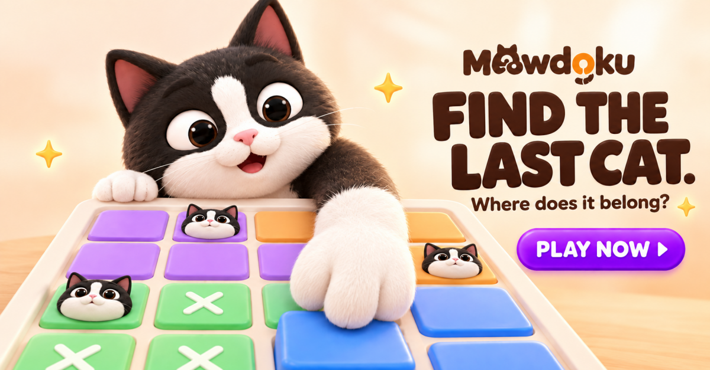
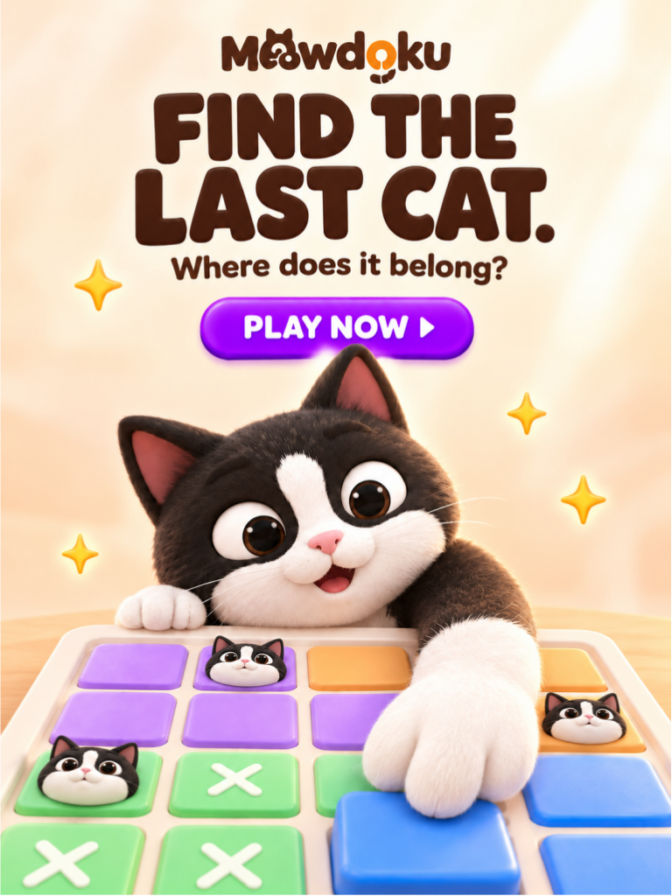
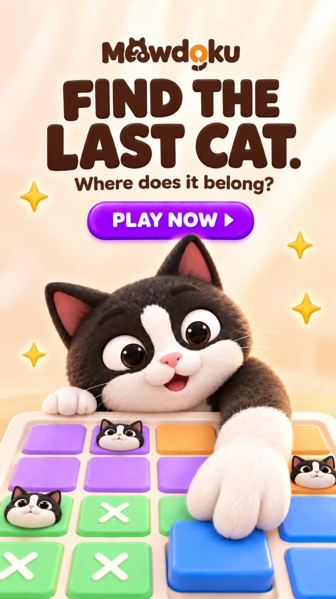

# Meowdoku 广告平面设计｜方向 B

## 项目说明
为 Meowdoku 制作一套广告平面素材，包含同一创意的三个尺寸主图，以及六张主角变体图。

当前状态：已上传三张主图、六张角色变体及制作过程，进行提交前检查。

## 创意方向
以“猫咪正在解题”为核心场景。

通过低机位、具有纵深的彩色棋盘，以及从上方伸向格子的猫爪，突出角色与玩法的互动。画面右侧安排挑战文案与行动按钮。

主文案：FIND THE LAST CAT.
副文案：Where does it belong?
行动按钮：PLAY NOW

## 角色与画风
依据提供的 Meowdoku 角色参考，保留黑白毛色、额头白纹、白色嘴套、粉色鼻子和棕色眼睛。
整套采用柔软 3D 质感与温暖配色。

## 交付清单
- [ ] 横版主图：1200 × 627 px
- [ ] 竖版主图：768 × 1024 px
- [ ] 全屏竖版主图：720 × 1280 px
- [ ] 六张主角变体图
- [ ] 制作过程与关键迭代版本
- [ ] 创意思路与制作说明

## 文件目录
- final：最终成图
- process：草稿与迭代版本
- docs：创意思路、提示词与修改记录

## 已进行的主要迭代
1. 角色从棋盘侧边探出，建立角色与玩法的组合。
2. 修正棋盘局部混色。
3. 调整为猫咪俯看棋盘，前爪落在一格上。
4. 进一步尝试低机位和前景放大，增强构图张力。

## 制作方式
使用 AI 图像生成工具辅助制作，并通过参考图、提示词调整和逐版检查推进设计。

## 作品入口

- [查看全部主图](final/main/)
- [查看六张角色变体](final/variants/)
- [查看制作过程与版本说明](docs/iterations.md)
- [查看过程原图](process/)

## 主图预览

### 横版
目标尺寸：1200 × 627 px

### 竖版
目标尺寸：768 × 1024 px

### 全屏竖版
目标尺寸：720 × 1280 px

