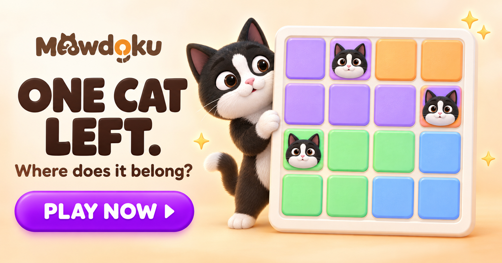
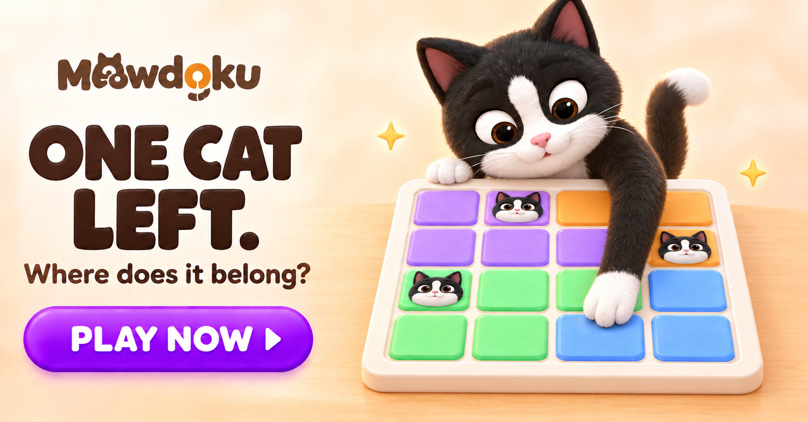
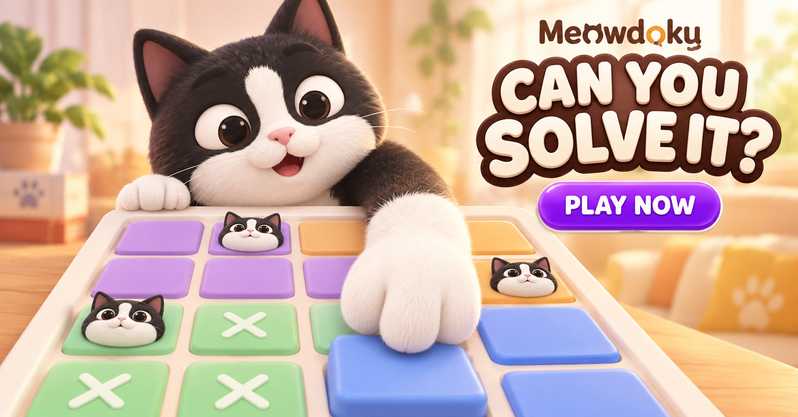
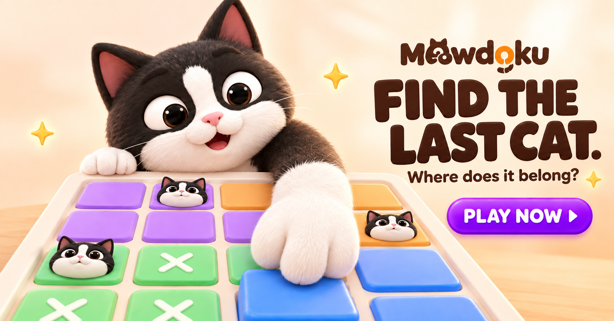
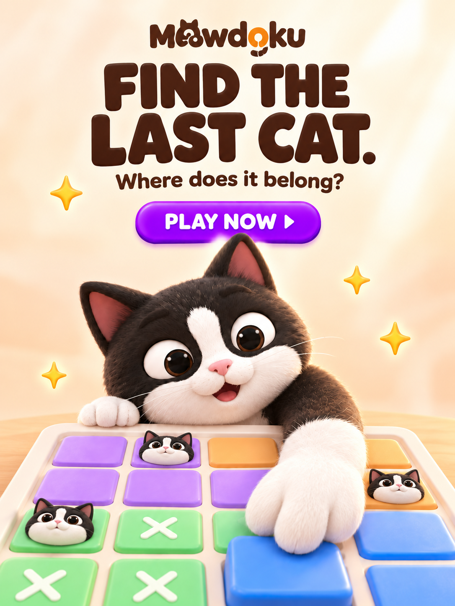
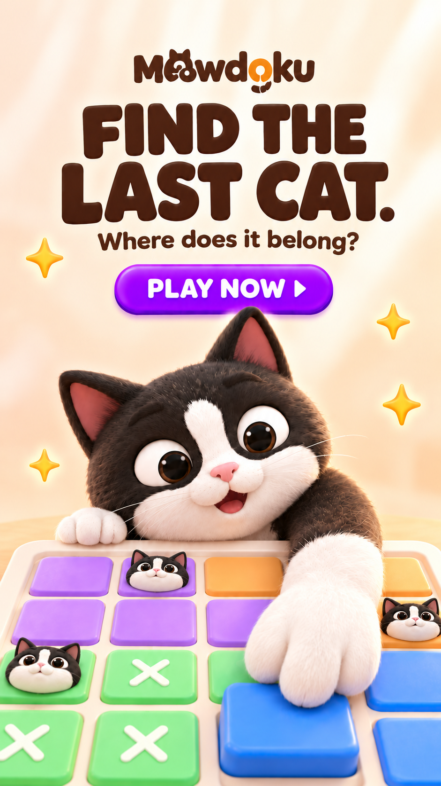
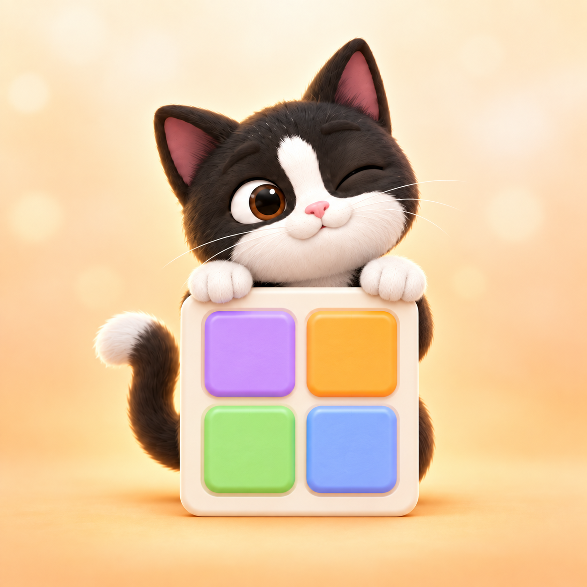
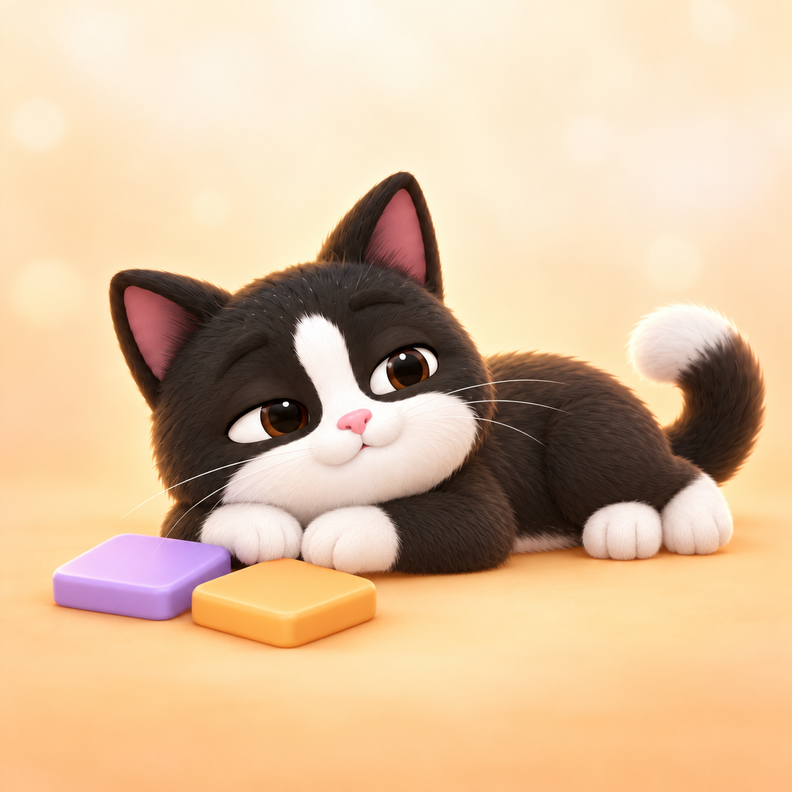
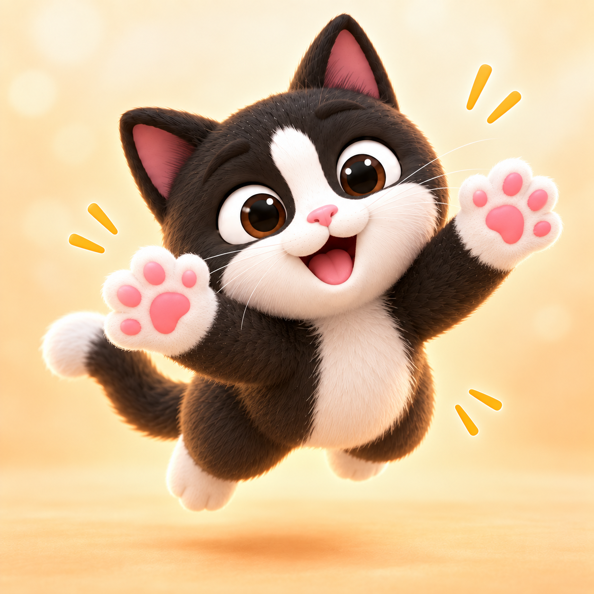

# 制作过程与版本记录

## 项目说明

本项目围绕 Meowdoku 的黑白奶牛猫主角，探索角色与逻辑棋盘的互动构图，并制作不同动作、表情和姿态的角色变体。

本页按归档编号展示作品。编号用于阅读顺序，不代表准确制作时间。
“定稿”是当前文件命名，最终交付仍需单独检查尺寸和画幅一致性。

## 一、主视觉探索

### 01 主视觉初稿
建立角色、棋盘、广告文案与行动按钮的基本关系。

### 02 主视觉俯视初稿
探索猫咪低头观察棋盘、伸爪参与解题的互动方式。

### 03 主视觉俯视文字未确定版
保留文案尚未确定阶段的画面，展示主视觉推进过程。

### 04 主视觉横版定稿候选
当前选定的横版版本，原文件名保留为“04主视觉横板图定稿.png”。
精确尺寸与最终交付检查另行记录。

## 二、竖版构图

以下记录两种竖向画幅的构图方案。
提交前需确认它们与选定横版采用同一创意、主体和文案。

### 05 竖版构图
目标交付尺寸：768 × 1024 px，实际尺寸待核验。

### 06 全屏竖版构图
目标交付尺寸：720 × 1280 px，实际尺寸待核验。

## 三、主角变体

围绕同一主角，分别探索思考、发现、探头、休息、喜爱和扑跃六种状态。

### 07 思考

### 08 发现

### 09 探头

### 10 休息

### 11 喜爱

### 12 扑跃

## 四、制作记录说明

本项目使用 AI 图像生成辅助制作，结合参考图、构图要求和提示词修改推进。
本页保存现有图像版本；具体提示词及后续编辑步骤另行补充。
没有发生修改的图片，不虚构额外迭代版本。

## 五、最终导出记录

保留 process 文件夹中的过程原图，将调整尺寸后的交付图单独保存于 final/main。

| 画幅 | 过程原图尺寸 | 最终导出尺寸 | 最终文件 |
|---|---|---|---|
| 横版 | 1734 × 907 px | 1200 × 627 px | main_1200x627.png |
| 竖版 | 1086 × 1448 px | 768 × 1024 px | main_768x1024.png |
| 全屏竖版 | 941 × 1672 px | 720 × 1280 px | main_720x1280.png |

最终导出使用 Windows 画图调整像素尺寸，另存为 PNG，保留过程原图。
三张主图的角色动作、创意方向与文案已由提交者人工对照检查。

最终文案：
- 主标题：FIND THE LAST CAT.
- 副标题：Where does it belong?
- CTA：PLAY NOW

## 六、交付检查

- [x] 已复查三个最终 PNG 的实际像素尺寸
- [x] 三张主图采用一致的创意方向、角色动作与文案
- [x] 主图包含明确的 CTA
- [x] 已上传六张角色变体
- [x] 最终作品已单独整理到 final 文件夹
- [x] 已保留过程图与版本说明
- [x] 补充关键提示词与人工调整记录

过程章节中的“初稿”“候选”和“待核验”描述对应当时的制作阶段；最终交付以本节及 final 文件夹为准。
